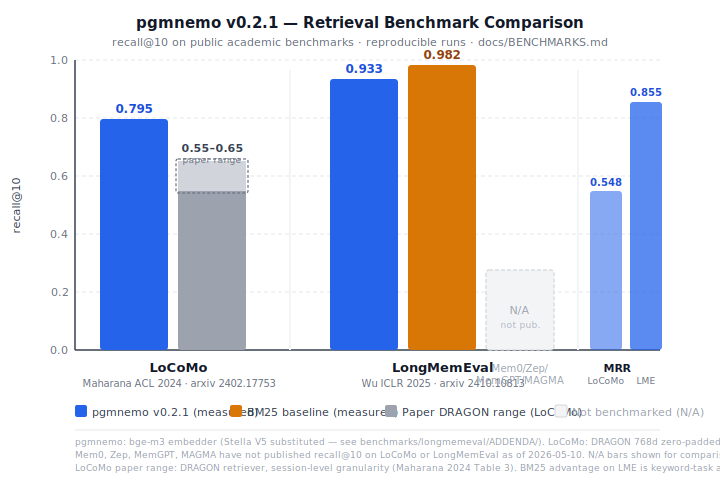

# pgmnemo

**Multi-agent memory substrate for PostgreSQL — provenance-gated, vector-hybrid recall.**

[](LICENSE)
[](CHANGELOG.md)
[](https://pgxn.org/dist/pgmnemo/)
[](https://github.com/pgmnemo/pgmnemo/actions/workflows/ci.yml)
[](https://www.postgresql.org/)
[](docs/img/all_metrics_history.md)
[](docs/img/all_metrics_history.md)

> **v0.3.0 (2026-05-10):** schema-additive release (`edge_kind` ENUM + 2 migration bug fixes). Recall unchanged vs v0.2.1 — see [release scorecard](docs/img/scorecard_v0.3.0.md).
>
> **What's next:** v0.4.0 (target 2026-06-10) — promote `recall_hybrid()` to default, target LongMemEval recall@10 ≥ 0.97 to beat the BM25 baseline. Full plan: [ROADMAP.md](ROADMAP.md). Workflow rules: [docs/WORKFLOW.md](docs/WORKFLOW.md).

## Benchmarks (v0.3.0, retrieval-only)

Real numbers vs published academic benchmarks. **Canonical protocol:** [benchmarks/PROTOCOL.md](benchmarks/PROTOCOL.md) (v1.0.0, frozen 2026-05-10) — release notes citing recall improvements must reference it. Full reproduction commands in [docs/BENCHMARKS.md](docs/BENCHMARKS.md). Methodology change log in [benchmarks/HISTORY.md](benchmarks/HISTORY.md).

<picture>
  
</picture>

| Benchmark | Embedder | Metric | pgmnemo | Comparison |
|---|---|---|---|---|
| **LoCoMo** ([Maharana ACL 2024](https://arxiv.org/abs/2402.17753)) | DRAGON (paper canonical) | recall@10 / MRR | **0.795** / **0.548** | paper DRAGON range 0.55–0.65 (session-level) |
| **LongMemEval** ([Wu ICLR 2025](https://arxiv.org/abs/2410.10813)) | bge-m3 (subst. for Stella V5)¹ | recall@10 / MRR | **0.933** / **0.855** | BM25 baseline² 0.982 |

¹ Stella V5 paper canonical incompatible with transformers 5.8 — substituted bge-m3 (1024d, MTEB-strong). [Addendum](benchmarks/longmemeval/ADDENDA/LONGMEMEVAL_EMBEDDER_BGE_M3.md).
² Pure-Python BM25 baseline included for reference: [run_nollm.py](benchmarks/longmemeval/run_nollm.py).

> **Competitor status:** Mem0, Zep, MemGPT, and MAGMA have not published recall@10 on LoCoMo or LongMemEval as of 2026-05-10. pgmnemo is among the first memory substrates to publish reproducible retrieval benchmarks on these academic datasets.

**Reproduce in 3 commands:** see [docs/BENCHMARKS.md#reproducibility](docs/BENCHMARKS.md#reproducibility).

**Honest caveats:** BM25 outperforms pgmnemo vector retrieval on LongMemEval (keyword-friendly task). [Hybrid retrieval (vector + BM25 RRF)](benchmarks/scripts/run_longmemeval_pgmnemo.py) is on the v0.2.2 roadmap.

## Why this exists

- **One differentiator none of Pinecone, Letta, Mem0, or Zep have:** a write-time provenance gate. Every `ingest()` call must carry a `commit_sha` or `artifact_hash`; rows without provenance are blocked (or warned) by default. Hallucinated agent memories cannot silently accumulate.
- **No new service.** `CREATE EXTENSION pgmnemo;` in your existing PostgreSQL — no separate API server, no SaaS endpoint, no vendor lock-in.
- **Hybrid recall in-database.** Cosine similarity (HNSW) + BM25 full-text + recency decay + importance weighting, scored in one SQL call.
- **Role isolation built in.** First-class `role + project_id` composite scoping; no hand-rolled RLS.

| Aspect | pgmnemo | Generic Vector DB | Cloud Memory API |
|---|---|---|---|
| Provenance enforcement | ✅ Mandatory | ❌ | ❌ |
| Zero data egress | ✅ In-database | ❌ | ❌ |
| Install model | `CREATE EXTENSION` | External service | SaaS API |
| Self-hosted price | Free (Apache 2.0) | $$$$ | $$$$$ |

## 30-second quickstart

**PGXN install (if pgxnclient is available):**

```bash
pgxn install pgmnemo
```

**From source (Docker):**

```bash
# 1. Start PG 17 + pgvector
docker run --name pgmnemo-dev -e POSTGRES_PASSWORD=pass -p 5432:5432 -d pgvector/pgvector:pg17

# 2. Build and install the extension (requires make, gcc, pg_config on PATH)
git clone https://github.com/pgmnemo/pgmnemo.git
docker exec pgmnemo-dev bash -c "apt-get install -y postgresql-server-dev-17 make gcc 2>/dev/null; true"
docker cp pgmnemo/extension pgmnemo-dev:/tmp/pgmnemo
docker exec pgmnemo-dev bash -c "cd /tmp/pgmnemo && make && make install"
```

```sql
-- psql -h localhost -U postgres

CREATE EXTENSION pgmnemo CASCADE;

SELECT pgmnemo.ingest(
    p_role        := 'developer',
    p_project_id  := 1,
    p_topic       := 'auth',
    p_lesson_text := 'Rotate JWT secrets after any key-compromise incident.',
    p_commit_sha  := 'abc1234'
);

SELECT lesson_text, score
FROM pgmnemo.recall_lessons(
    query_embedding := array_fill(0, ARRAY[1024])::vector(1024),
    query_text      := 'JWT secret rotation',
    role_filter     := 'developer'
);
```

> For a native install (no Docker), see [INSTALL.md](INSTALL.md).

## Features

- **HNSW vector search** — fast approximate nearest-neighbour recall via `pgvector` HNSW indexes
- **Provenance gate** — `enforce` / `warn` / `off` modes; controlled by `pgmnemo.gate_strict` GUC
- **Recency-weighted scoring** — `0.5×cosine + 0.2×importance + γ×recency(90d) + 0.1×prov_strength`; γ tunable via `pgmnemo.recency_weight`
- **Role scoping** — `role + project_id` composite isolation; `role_filter=NULL` pools across roles
- **Graph traversal** — `traverse_causal_chain()` and `traverse_temporal_window()` walk typed `mem_edge` relationships between lessons
- **MAGMA edge taxonomy** (v0.3.0, **EXPERIMENTAL**) — `edge_kind` ENUM (`semantic | temporal | causal | entity`) with per-kind partial indexes; `recall_lessons()` BFS graph-proximity now correctly uses `edge_kind` instead of the broken v0.2.x `relation_type` string matching. MAGMA §4 (adaptive traversal policy) and §5 (dual-stream consolidation) are not yet implemented.

## Compatibility

| PostgreSQL | Status | pgvector | Platform |
|---|---|---|---|
| 17 | Fully tested | ≥ 0.7.0 required | amd64 (Docker + native) |
| 14–16 | Best-effort | ≥ 0.7.0 required | amd64 (Docker + native) |
| < 14 | Not supported | — | — |
| arm64 | Source-build only | ≥ 0.7.0 required | No pre-built images |

## Documentation

- [INSTALL.md](INSTALL.md) — build, install, configure, upgrade
- [docs/USAGE.md](docs/USAGE.md) — API reference and tuning guide
- [CHANGELOG.md](CHANGELOG.md) — version history
- [docs/MIGRATION.md](docs/MIGRATION.md) — upgrade path and migration notes
- [docs/PRODUCTION_READINESS.md](docs/PRODUCTION_READINESS.md) — production deployment checklist
- [examples/](examples/) — annotated runnable examples (init, ingestion, recall)
- [integrations/langchain/](integrations/langchain/) — LangChain retriever integration (`pgmnemo_langchain`)

## License

Apache License 2.0 — see [LICENSE](LICENSE).

## Contributing

See [CONTRIBUTING.md](CONTRIBUTING.md). Contributions accepted under the DCO sign-off model.

## Citing

```bibtex
@misc{gaydabura2026pgmnemo,
  author = {Gaydabura, Alex and pgmnemo contributors},
  title  = {pgmnemo: A Provenance-Gated Multi-Agent Memory Substrate for PostgreSQL},
  year   = {2026},
  note   = {ICSE-SEIP submission in preparation}
}
```

