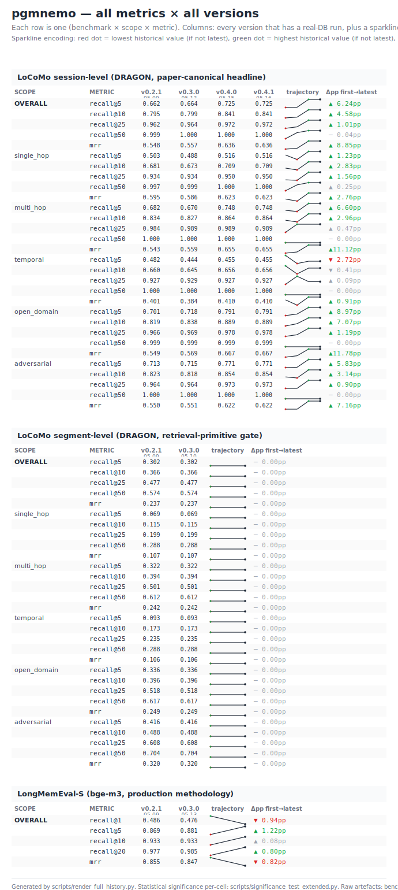

# pgmnemo — all metrics × all versions

Tufte-style sparkline table. Each row is one (benchmark × scope × metric).

## LoCoMo session-level  (DRAGON, paper-canonical headline)

| scope | metric | v0.2.1 | v0.3.0 | v0.4.0 | Δ first→latest |
|---|---|---|---|---|---|
| **OVERALL** | `recall@5` | 0.662 | 0.664 | 0.725 | ▲6.24pp |
| **OVERALL** | `recall@10` | 0.795 | 0.799 | 0.841 | ▲4.58pp |
| **OVERALL** | `recall@25` | 0.962 | 0.964 | 0.972 | ▲1.01pp |
| **OVERALL** | `recall@50` | 0.999 | 1.000 | 1.000 | ─0.04pp |
| **OVERALL** | `mrr` | 0.548 | 0.557 | 0.636 | ▲8.85pp |
| **single_hop** | `recall@5` | 0.503 | 0.488 | 0.516 | ▲1.23pp |
| **single_hop** | `recall@10` | 0.681 | 0.673 | 0.709 | ▲2.83pp |
| **single_hop** | `recall@25` | 0.934 | 0.934 | 0.950 | ▲1.56pp |
| **single_hop** | `recall@50` | 0.997 | 0.999 | 1.000 | ─0.25pp |
| **single_hop** | `mrr` | 0.595 | 0.586 | 0.623 | ▲2.76pp |
| **multi_hop** | `recall@5` | 0.682 | 0.670 | 0.748 | ▲6.60pp |
| **multi_hop** | `recall@10` | 0.834 | 0.827 | 0.864 | ▲2.96pp |
| **multi_hop** | `recall@25` | 0.984 | 0.989 | 0.989 | ─0.47pp |
| **multi_hop** | `recall@50` | 1.000 | 1.000 | 1.000 | ─0.00pp |
| **multi_hop** | `mrr` | 0.543 | 0.559 | 0.655 | ▲11.12pp |
| **temporal** | `recall@5` | 0.482 | 0.444 | 0.455 | ▼2.72pp |
| **temporal** | `recall@10` | 0.660 | 0.645 | 0.656 | ─0.41pp |
| **temporal** | `recall@25` | 0.927 | 0.929 | 0.927 | ─0.09pp |
| **temporal** | `recall@50` | 1.000 | 1.000 | 1.000 | ─0.00pp |
| **temporal** | `mrr` | 0.401 | 0.384 | 0.410 | ▲0.91pp |
| **open_domain** | `recall@5` | 0.701 | 0.718 | 0.791 | ▲8.97pp |
| **open_domain** | `recall@10` | 0.819 | 0.838 | 0.889 | ▲7.07pp |
| **open_domain** | `recall@25` | 0.966 | 0.969 | 0.978 | ▲1.19pp |
| **open_domain** | `recall@50` | 0.999 | 0.999 | 0.999 | ─0.00pp |
| **open_domain** | `mrr` | 0.549 | 0.569 | 0.667 | ▲11.78pp |
| **adversarial** | `recall@5` | 0.713 | 0.715 | 0.771 | ▲5.83pp |
| **adversarial** | `recall@10` | 0.823 | 0.818 | 0.854 | ▲3.14pp |
| **adversarial** | `recall@25` | 0.964 | 0.964 | 0.973 | ▲0.90pp |
| **adversarial** | `recall@50` | 1.000 | 1.000 | 1.000 | ─0.00pp |
| **adversarial** | `mrr` | 0.550 | 0.551 | 0.622 | ▲7.16pp |

## LoCoMo segment-level  (DRAGON, retrieval-primitive gate)

| scope | metric | v0.2.1 | v0.3.0 | Δ first→latest |
|---|---|---|---|---|
| **OVERALL** | `recall@5` | 0.302 | 0.302 | ─0.00pp |
| **OVERALL** | `recall@10` | 0.366 | 0.366 | ─0.00pp |
| **OVERALL** | `recall@25` | 0.477 | 0.477 | ─0.00pp |
| **OVERALL** | `recall@50` | 0.574 | 0.574 | ─0.00pp |
| **OVERALL** | `mrr` | 0.237 | 0.237 | ─0.00pp |
| **single_hop** | `recall@5` | 0.069 | 0.069 | ─0.00pp |
| **single_hop** | `recall@10` | 0.115 | 0.115 | ─0.00pp |
| **single_hop** | `recall@25` | 0.199 | 0.199 | ─0.00pp |
| **single_hop** | `recall@50` | 0.288 | 0.288 | ─0.00pp |
| **single_hop** | `mrr` | 0.107 | 0.107 | ─0.00pp |
| **multi_hop** | `recall@5` | 0.322 | 0.322 | ─0.00pp |
| **multi_hop** | `recall@10` | 0.394 | 0.394 | ─0.00pp |
| **multi_hop** | `recall@25` | 0.501 | 0.501 | ─0.00pp |
| **multi_hop** | `recall@50` | 0.612 | 0.612 | ─0.00pp |
| **multi_hop** | `mrr` | 0.242 | 0.242 | ─0.00pp |
| **temporal** | `recall@5` | 0.093 | 0.093 | ─0.00pp |
| **temporal** | `recall@10` | 0.173 | 0.173 | ─0.00pp |
| **temporal** | `recall@25` | 0.235 | 0.235 | ─0.00pp |
| **temporal** | `recall@50` | 0.288 | 0.288 | ─0.00pp |
| **temporal** | `mrr` | 0.106 | 0.106 | ─0.00pp |
| **open_domain** | `recall@5` | 0.336 | 0.336 | ─0.00pp |
| **open_domain** | `recall@10` | 0.396 | 0.396 | ─0.00pp |
| **open_domain** | `recall@25` | 0.518 | 0.518 | ─0.00pp |
| **open_domain** | `recall@50` | 0.617 | 0.617 | ─0.00pp |
| **open_domain** | `mrr` | 0.249 | 0.249 | ─0.00pp |
| **adversarial** | `recall@5` | 0.416 | 0.416 | ─0.00pp |
| **adversarial** | `recall@10` | 0.488 | 0.488 | ─0.00pp |
| **adversarial** | `recall@25` | 0.608 | 0.608 | ─0.00pp |
| **adversarial** | `recall@50` | 0.704 | 0.704 | ─0.00pp |
| **adversarial** | `mrr` | 0.320 | 0.320 | ─0.00pp |

## LongMemEval-S  (bge-m3, production methodology)

| scope | metric | v0.2.1 | v0.3.0 | Δ first→latest |
|---|---|---|---|---|
| **OVERALL** | `recall@1` | 0.486 | 0.476 | ▼0.94pp |
| **OVERALL** | `recall@5` | 0.869 | 0.881 | ▲1.22pp |
| **OVERALL** | `recall@10` | 0.933 | 0.933 | ─0.08pp |
| **OVERALL** | `recall@20` | 0.977 | 0.985 | ▲0.80pp |
| **OVERALL** | `mrr` | 0.855 | 0.847 | ▼0.82pp |