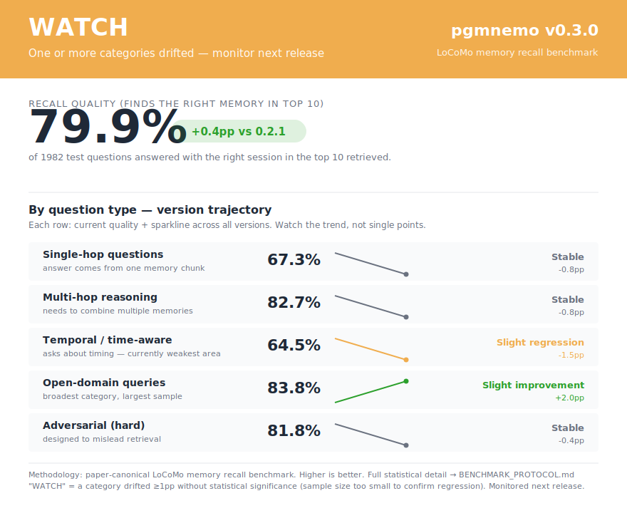

# Release scorecard: pgmnemo v0.3.0



```
══════════════════════════════════════════════════════════════════════
  WATCH   pgmnemo v0.3.0   LoCoMo memory recall benchmark
  One or more categories drifted — monitor next release
══════════════════════════════════════════════════════════════════════

  RECALL QUALITY (finds the right memory in top 10):

      ┌──────────┐
      │   79.9%  │   +0.4pp vs 0.2.1
      └──────────┘

══════════════════════════════════════════════════════════════════════
  BY QUESTION TYPE
══════════════════════════════════════════════════════════════════════
  Single-hop    ████████████████████··········  67.3%  ─-0.8pp  Stable
               (one memory chunk)
  Multi-hop     ████████████████████████······  82.7%  ─-0.8pp  Stable
               (combine multiple memories)
  Temporal      ███████████████████···········  64.5%  ▼-1.5pp  Slight regression
               (time-aware — historically weakest)
  Open-domain   █████████████████████████·····  83.8%  ▲+2.0pp  Slight improvement
               (broadest category)
  Adversarial   ████████████████████████······  81.8%  ─-0.4pp  Stable
               (designed to mislead)

══════════════════════════════════════════════════════════════════════
```
