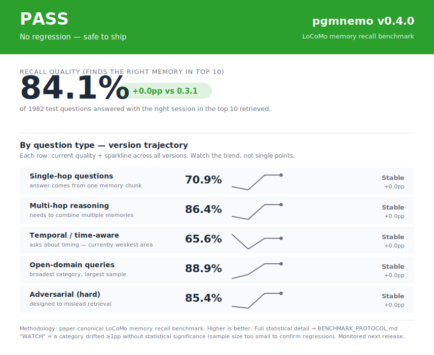

# Release scorecard: pgmnemo v0.4.0



```
══════════════════════════════════════════════════════════════════════
  PASS   pgmnemo v0.4.0   LoCoMo memory recall benchmark
  No regression — safe to ship
══════════════════════════════════════════════════════════════════════

  RECALL QUALITY (finds the right memory in top 10):

      ┌──────────┐
      │   84.1%  │   +0.0pp vs 0.3.1
      └──────────┘

══════════════════════════════════════════════════════════════════════
  BY QUESTION TYPE
══════════════════════════════════════════════════════════════════════
  Single-hop    █████████████████████·········  70.9%  ─+0.0pp  Stable
               (one memory chunk)
  Multi-hop     █████████████████████████·····  86.4%  ─+0.0pp  Stable
               (combine multiple memories)
  Temporal      ███████████████████···········  65.6%  ─+0.0pp  Stable
               (time-aware — historically weakest)
  Open-domain   ██████████████████████████····  88.9%  ─+0.0pp  Stable
               (broadest category)
  Adversarial   █████████████████████████·····  85.4%  ─+0.0pp  Stable
               (designed to mislead)

══════════════════════════════════════════════════════════════════════
```
